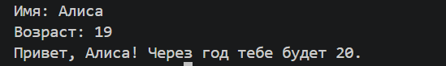
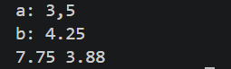
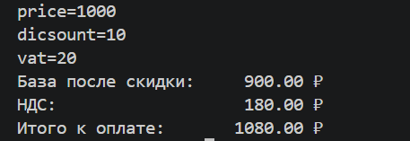
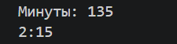
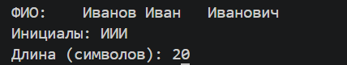
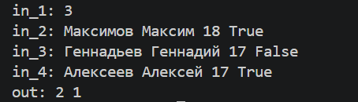
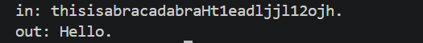

# ЛР1 — Ввод/вывод и форматирование
## Задание 1
Программа считывает имя и возраст, преобразует возраст в целое число и выводит сообщение с возрастом через год.

```
name = input("Имя: ")
age = int(input("Возраст: "))
print(f"Привет, {name}! Через год тебе будет {age+1}.")
```




## Задание 2
Считываются 2 числа, перед переводом строки в тип float запятые заменяются на точки. Программа выводит сумму и среднее арифметическое с точностью до 2 знаков после запятой.

```
a = float(input('a: ').replace(',', '.'))
b = float(input('b: ').replace(',', '.'))
sm = a+b
avg = sm/2
print(f'{sm:.2f}', f'{avg:.2f}')
```




## Задание 3
```
price = float(input('price='))
discount = float(input('dicsount='))
vat = float(input('vat='))

base = price * (1 - discount/100)
vat_amount = base * (vat/100)
total = base + vat_amount

print(f'База после скидки: {base:>10.2f} ₽')
print(f'НДС:               {vat_amount:>10.2f} ₽')
print(f'Итого к оплате:    {total:>10.2f} ₽')
```




## Задание 4
Вводится число, преобразуется в целое число. Часы считаются как целая часть при делении на 60, минуты - как остаток при делении на 60.

```
m = int(input('Минуты: '))

h = m//60
m = m % 60
print(f'{h}:{m:02d}')
```




## Задание 5
Вводится ФИО, из строки делается список, где каждый элемент - отдельное слово(с помощью .split()). Далее создается строка, состоящая из первых букв каждого слова в списке, все буквы меняются на заглавные. Длина исходной строки без лишних пробелов вычисляется как сумма длин каждого слова + 2 пробела.

```
name = input('ФИО: ').split()
initials = name[0][0]+name[1][0]+name[2][0]
res = initials.upper()
l = len(name[0])+len(name[1])+len(name[2])+2
print(f'Инициалы: {res}')
print(f'Длина (символов): {l}')
```




## Задание 6
Вводится число n, после этого вводится n строк. После каждой введенной строки происходит проверка ее последних символов. Если в конце находится True, то увеличивается счетчик a, иначе - счетчик b.

```
n = int(input('in_1: '))

a = 0
b = 0
for i in range(n):
    l = input(f'in_{2+i}: ').split()
    if l[-1] == 'True':
        a += 1
    else:
        b += 1

print(f'out: {a} {b}')
```




## Задание 7
Считывается строка и создается отдельная пустая строка. Находим первую заглавную букву и первую букву после нее, стоящую за цифрой. Добавляем их в пустую строку и сохраняем индексы этих букв. Вычисляем шаг, с которым идут символы и добавляем остальные буквы, начиная со следующей после 2й(letter2+d).

```
s = input('in: ')

word = ''
letter1 = 0
letter2 = 0
for i in range(len(s)):
    if s[i] == s[i].upper() and len(word) == 0:
        word += s[i]
        letter1 = i
    if len(word) == 1 and s[i] in '0123456789':
        word += s[i+1]
        letter2 = i+1
        break

d = letter2-letter1
for i in range(letter2+d, len(s), d):
    word += s[i]
    if s[i]=='.': break

print(f'out: {word}')
```




