# ЛР2 — Коллекции и матрицы (list/tuple/set/dict)
## Задание 1
1. 

'''
def min_max(nums):
    '''
    возвращает минимальный и максимальный элементы списка nums в виде кортежа (min,max)
    '''

    if len(nums) == 0:
        raise ValueError('пустой список')

    mn = nums[0]
    mx = nums[0]
    for x in nums:
        if x < mn:
            mn = x
        if x > mx:
            mx = x
    return (mn, mx)
'''

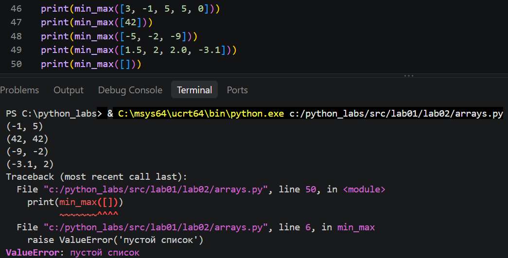

2. 

'''
def bubble_sort(l):  # пузырьковая сортировка
    n = len(l)
    for i in range(n):
        for j in range(n-i-1):
            if l[j] > l[j+1]:
                l[j], l[j+1] = l[j+1], l[j]
    return l

def unique_sorted(nums):
    '''возвращает отсортированный список уникальных значений по возрастанию'''

    unique_nums = list(set(nums))
    return bubble_sort(unique_nums)
'''

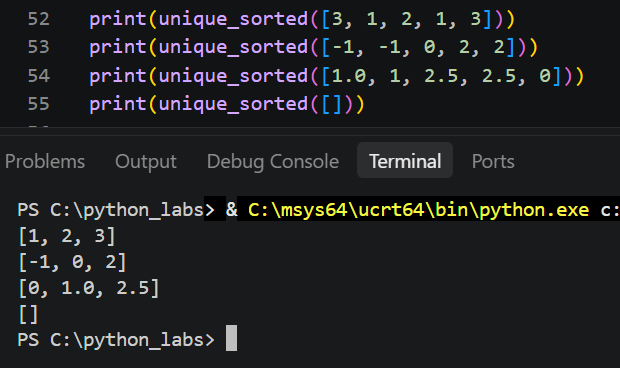

3. 

'''
def flatten(mat):
    '''расплющивает матрицу в один список по строкам'''

    if type(mat) != list:
        raise TypeError('Введен не список')

    l = []
    for row in mat:
        if type(row) == list or type(row) == tuple:
            l.extend(row)
        else:
            raise TypeError(
                'элемент внутри списка не является списком или кортежем')
    return l
'''

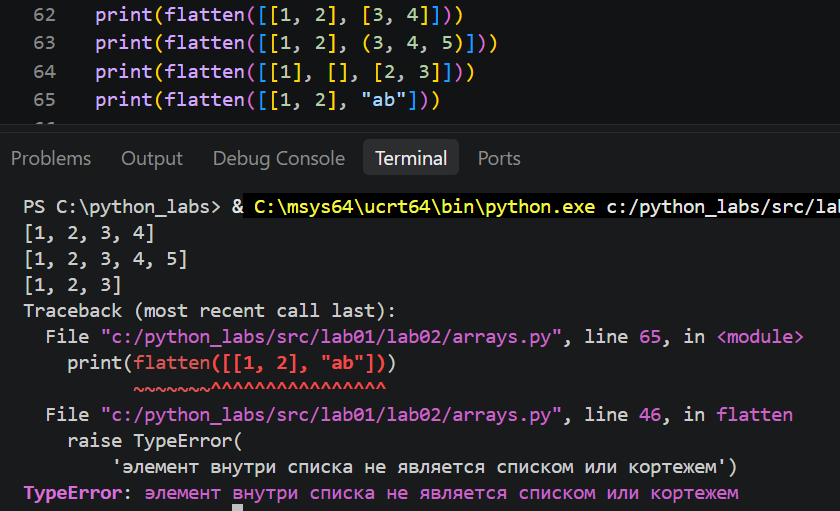

## Задание 2
1. 

'''
def transpose(mat):
    '''транспонирует прямоугольную матрицу'''

    if len(mat) == 0:
        return mat
    m = len(mat)
    n = len(mat[0])

    for row in mat:
        if len(row) != n:
            raise ValueError('строки разной длины')

    if len(mat[0]) == 0:
        return []

    # создание нулевой матрицы размера n*m (для исходной матрицы m*n)
    transposed_mat = [[mat[i][j] for i in range(m)] for j in range(n)]

    for i in range(m):
        for j in range(n):
            transposed_mat[j][i] = mat[i][j]

    return transposed_mat
'''

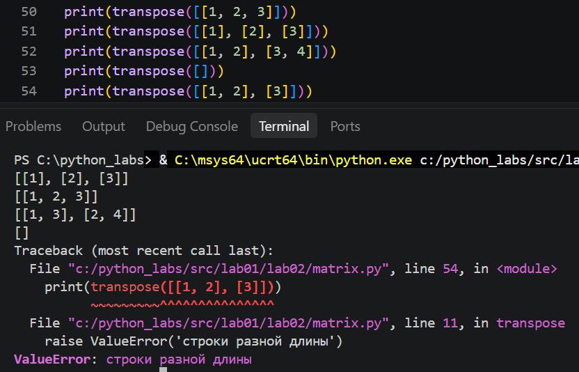

2. 

'''
def row_sums(mat):
    '''возвращает список с суммой чисел в каждой строке матрицы'''

    if len(mat) == 0:
        return []

    n = len(mat[0])
    for row in mat:
        if len(row) != n:
            raise ValueError("строки разной длины")

    return [sum(row) for row in mat]
'''

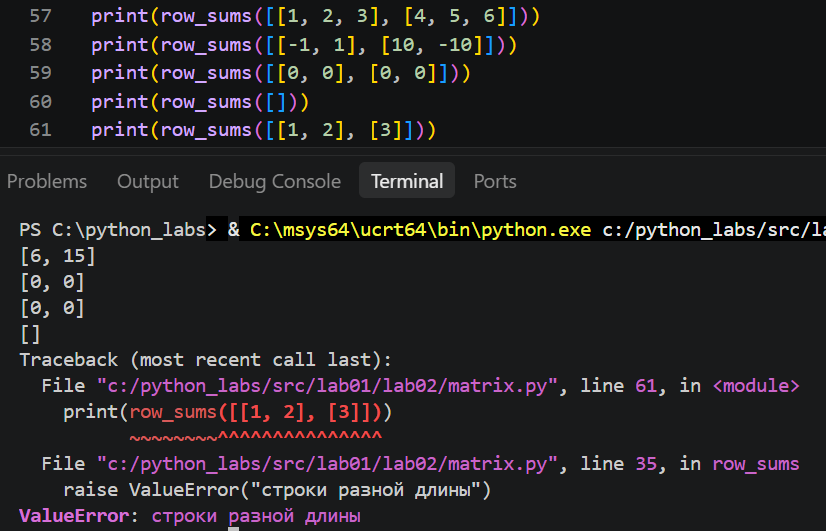

3. 

'''
def col_sums(mat):
    '''возвращает список с суммой чисел в каждом столбце матрицы'''

    if len(mat)==0:
        return []
    
    transposed_mat = transpose(mat)
    return row_sums(transposed_mat)
'''

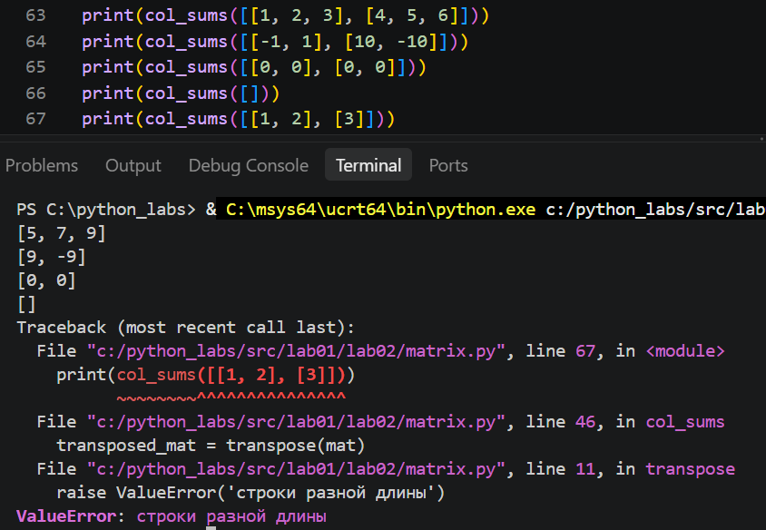

## Задание 3

'''
def format_record(rec):
    '''возвращает строку вида: Фамилия И.О., гр. <группа>, GPA <оценка>. При некорректной записи возвращает ValueError'''
    
    s = ''
    if len(rec) != 3:
        raise ValueError('Неверно введены данные в кортеже')

    str_without_whitespace = rec[0].replace(' ', '')

    # преобразование имени
    if type(rec[0]) == str and str_without_whitespace.isalpha():
        if len(rec[0].split()) == 2:
            name_list = rec[0].title().split()
            name_str = name_list[0] + ' ' + name_list[1][0] + '., '
            s = s + name_str
        elif len(rec[0].split()) == 3:
            name_list = rec[0].title().split()
            name_str = name_list[0] + ' ' + \
                name_list[1][0] + '.' + name_list[2][0] + '., '
            s = s + name_str
        else:
            raise ValueError('Неверно введено имя!')
    else:
        raise ValueError(
            'Имя не является строкой либо есть символы, не являющиеся буквой или пробелом')

    # преобразование группы
    gr_without_whitespace = rec[1].replace(' ', '')

    if len(gr_without_whitespace) > 0:
        s = s + 'гр. ' + gr_without_whitespace + ', '
    else:
        raise ValueError('Группа введена неверно')

    # преобразование оценки
    if (type(rec[2]) == float or type(rec[2]) == int) and (0.0 <= rec[2] <= 5.0):
        s = s+'GPA ' + f'{rec[2]:.2f}'
    else:
        raise ValueError('неверно введена оценка')

    return s
'''

Неправильный ввод:
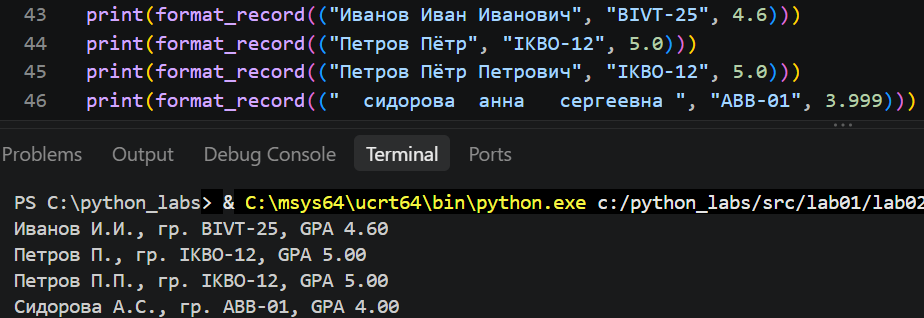
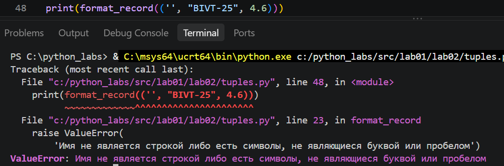
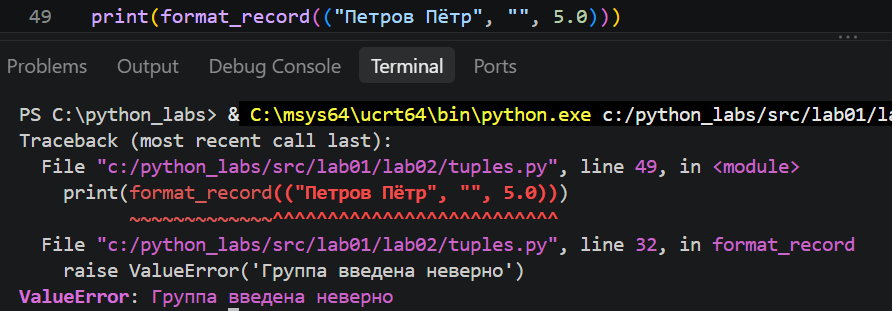
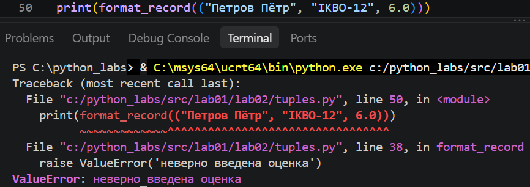
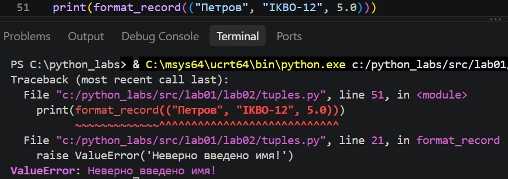
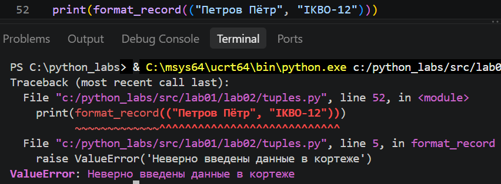